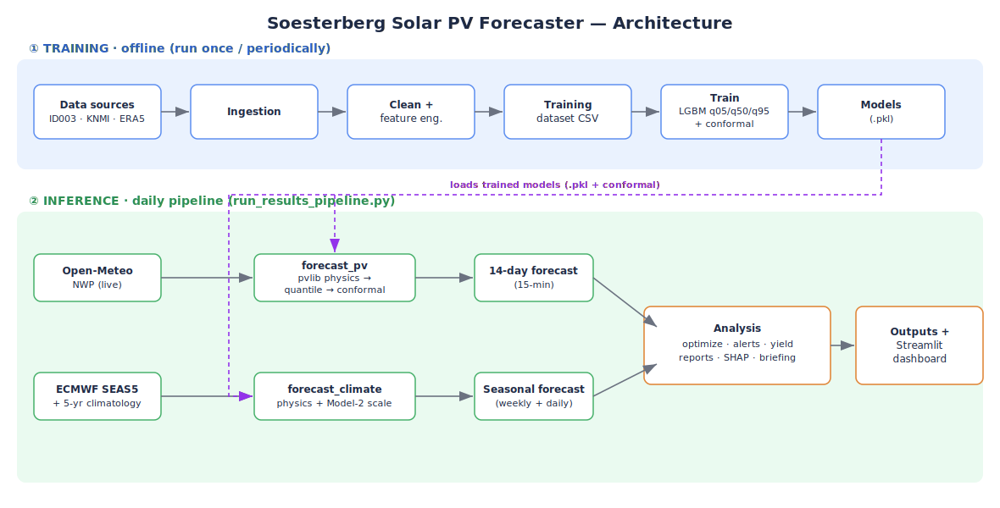
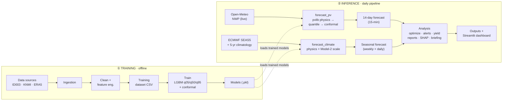

# ☀️ Solar PV Generation Forecaster

**Operational machine-learning forecaster for rooftop photovoltaic (PV) generation at the Soesterberg (NL) site.**
It turns a weather forecast into a probabilistic solar-energy forecast (next 14 days at 15-minute resolution, plus a seasonal outlook to 12 months), then layers on optimization, alerting, financial reporting, and explainability.

> **Tech stack:** Python · LightGBM (quantile regression) · pvlib · scikit-learn · SHAP · conformal prediction · Streamlit + Plotly · Open-Meteo / KNMI / ECMWF SEAS5 / PVGIS

---

## 1. Project Overview

### What it does
Given a weather forecast, the model predicts the **capacity factor (CF)** of a real PV system — the fraction of nameplate power the array delivers each interval — and converts it to energy (kWh). It produces:

- a **14-day operational forecast** at 15-minute resolution, with a P5–P95 uncertainty band;
- a **2-to-52-week seasonal forecast** (weekly and daily files);
- **load-shifting optimization**, **weather alerts**, **monthly/annual yield & savings reports**, and **SHAP explainability**;
- a plain-language **daily briefing** generated by a local LLM.

### Problem it solves
Solar output is highly variable and weather-driven. Grid operators, energy traders, and prosumers need **accurate short-term generation forecasts with calibrated uncertainty** to schedule loads, size batteries, bid into markets, and estimate savings. This project delivers an end-to-end, reproducible forecasting pipeline trained on **real measured generation** rather than synthetic data.

### High-level approach
The system is a **weather-driven Model-Output-Statistics (MOS) forecaster**, not an autoregressive time-series model:

```
NWP weather forecast ──► physics features (pvlib: POA irradiance, clear-sky, cell temp)
                           │
                           ▼
              LightGBM quantile models (P5 / P50 / P95)  ──►  capacity factor
                           │
                           ▼
              Mondrian conformal calibration  ──►  reliable uncertainty band
                           │
                           ▼
                  CF × system size  ──►  kWh forecast  ──►  optimize / alert / report
```

Because output is driven by *exogenous* weather rather than its own past values, the model generalizes across years and avoids autoregressive drift.

---

## Architecture



<details>
<summary>Mermaid version (editable / GitHub-native)</summary>



</details>

---

## 2. Dataset Description

At runtime all data lives under `data/`, split into **raw → cleaned → models → outputs**.

### Data availability

> ⚠️ **The `data/` folder is _not_ tracked in this repository.** The raw measurements alone are several GB, and the third-party weather/PV data remain subject to their providers' terms. To reproduce the project, download the sources below into `data/raw/` and run the preprocessing pipeline (§6 A) to regenerate the cleaned, training, and output files.

| Data | Source | Download |
|------|--------|----------|
| **PV power generation** (ID003 inverter — 1-min residential rooftop measurements, Utrecht NL) | *"Open-source quality control routine and multi-year power generation data of 175 PV systems"* — Visser, Elsinga et al., Zenodo (2022) | <https://zenodo.org/records/6906504> |
| **Historical weather** (KNMI De Bilt 10-min station — irradiance, cloud, temp, wind, humidity, rain) | KNMI Data Platform API | <https://developer.dataplatform.knmi.nl/apis/> |
| **ERA5 reanalysis** (legacy hourly baseline) | ECMWF / Copernicus — fetched by `src/ingestion/fetch_era5.py` | <https://cds.climate.copernicus.eu/> |
| **Live NWP & seasonal forecasts** | Open-Meteo + ECMWF SEAS5 — fetched at inference time by `src/ingestion/` | <https://open-meteo.com/> |

After placing the PV and KNMI files in `data/raw/`, run the ingestion + engineering scripts in §6 A to rebuild everything else.

### Inputs

| File | Source | Role |
|------|--------|------|
| `data/raw/id003_production_raw_extracted.csv` | ID003 inverter (real site) | Raw measured PV power |
| `data/raw/filtered_pv_power_measurements_ac.csv` | ID003 inverter | Filtered AC power measurements |
| `data/raw/Soesterberg_KNMI_10min.csv` | **KNMI De Bilt** 10-min station | Real observed weather (irradiance, cloud, temp, wind, humidity, rain) |
| `data/raw/Soesterberg_NL_weather_2009-2017_hourly_ERA5.csv` | ECMWF ERA5 reanalysis | Legacy hourly weather (historical baseline) |
| `data/raw/site_historical_weather.csv` | Open-Meteo Archive | 5-yr daily history for seasonal climatology |
| `data/raw/metadata.csv` | — | Site / system metadata |

### Cleaned & training data

| File | Description |
|------|-------------|
| `data/cleaned/id003_production_10min.csv` | Production resampled 1-min → 10-min, with capacity factor |
| `data/cleaned/Soesterberg_KNMI_10min_cleaned.csv` | Cleaned 10-min weather (2014–2017) |
| `data/models/training_dataset_real-weather-generation.csv` | **Final joined training table** (weather + physics features + measured CF) |

### Feature types
- **Physics / solar geometry** — plane-of-array (POA) irradiance, clear-sky GHI & POA, clear-sky index, solar elevation/azimuth, air mass, angle of incidence, cell-temperature derating.
- **Weather** — shortwave radiation, cloud cover, temperature, humidity, wind speed, precipitation, dew point.
- **Interactions** — clouds × elevation, humidity × radiation, thermal/wind-cooling factors.
- **Temporal dynamics** — short-range radiation/cloud lags, 3-hour rolling means, cloud-motion deltas, cloud-burst / irradiance-drop flags.
- **Calendar (Fourier)** — hour, month, day-of-year encoded as sin/cos.

### Target variable
**`capacity_factor`** — measured AC power ÷ system nameplate, in **[0, 1]**, derived from the **ID003 inverter** (real generation). Multiplying CF by system size (kWp) yields energy in kWh.

---

## 3. Project Structure

```
soesterberg-solar-forecaster/
├── README.md
├── requirements.txt
├── .gitignore
├── app/
│   └── dashboard.py                 # Streamlit + Plotly interactive dashboard
├── data/                            # (not tracked in git — see §2 Data availability)
│   ├── raw/                         # Source data (inverter, KNMI, ERA5, metadata)
│   ├── cleaned/                     # Resampled & cleaned 10-min series
│   ├── models/                      # Trained models + final training CSV
│   │   ├── lgbm_real_q05.pkl        # LightGBM P5  quantile model
│   │   ├── lgbm_real_q50.pkl        # LightGBM P50 (point forecast)
│   │   ├── lgbm_real_q95.pkl        # LightGBM P95 quantile model
│   │   └── conformal_correction_real.pkl   # Mondrian conformal calibration
│   └── outputs/                     # All generated forecasts, reports, SHAP, briefings
└── src/
    ├── ingestion/                   # Pull raw data from sources
    │   ├── extract_id003.py             #   inverter production
    │   ├── fetch_knmi_10min_raw_data.py #   KNMI 10-min weather
    │   ├── fetch_era5.py                #   ERA5 reanalysis (legacy)
    │   └── fetch_seas5_om.py            #   ECMWF SEAS5 seasonal forecast
    ├── engenering/                  # Cleaning + feature engineering
    │   ├── id003_1_minutes_to_10_minutes.py  # resample production
    │   ├── wheather_data_cleaning.py         # clean weather
    │   ├── engineering.py                    # canonical feature builder (train == serve)
    │   └── build_training_real_weather.py    # join → training_dataset CSV
    ├── models/
    │   └── train_pv_real.py         # ★ Train quantile models + conformal calibration
    ├── inference/
    │   ├── forecast_pv.py           # ★ 14-day operational forecast (Open-Meteo → kWh)
    │   └── forecast_climate.py      # ★ Seasonal forecast (SEAS5 + climatology)
    ├── analysis/
    │   ├── optimizer.py             # load-shift / self-consumption optimization
    │   ├── alerts.py                # weather-risk alerts (rain, wind, soiling)
    │   ├── yield_model.py           # PVGIS-anchored annual yield
    │   ├── report.py                # 14-day + monthly financial reports
    │   ├── xai.py                   # SHAP explainability (forward + retrospective)
    │   └── briefing.py              # local-LLM daily briefing + validation
    └── pipeline/
        └── run_results_pipeline.py  # ★ Orchestrates the full daily run (Steps 1–8)
```

★ = primary entry points.

---

## 4. Methodology

### Model family
Three **LightGBM gradient-boosted quantile regressors** trained on the same 49 physics + weather + calendar features:

| Model | Quantile (α) | Purpose |
|-------|--------------|---------|
| `lgbm_real_q05` | 0.05 | Lower bound of uncertainty band |
| `lgbm_real_q50` | 0.50 | **Point forecast** (median) |
| `lgbm_real_q95` | 0.95 | Upper bound of uncertainty band |

Key hyperparameters: `n_estimators=2000` (early-stopped), `max_depth=6`, `num_leaves=31`, `learning_rate=0.05`, `subsample=0.8`, `colsample_bytree=0.8`, `objective="quantile"`.

### Why MOS instead of ARIMA/foundation models
The forecast is conditioned on a numerical weather prediction (NWP), then a physics layer (pvlib Hay-Davies transposition, Ineichen clear-sky, NOCT cell-temperature model) produces irradiance/temperature features, and the ML layer learns the **residual mapping weather → capacity factor**. This is robust to multi-year drift and the extreme day/night seasonality that defeats linear autoregressive models.

### Uncertainty: Mondrian conformal prediction
Raw quantile bands are recalibrated with **split (Mondrian) conformal prediction**, computing separate corrections for **normal** vs **extreme** regimes (cloud-burst / irradiance-drop), targeting **80% coverage** with a correction cap of 0.10 CF. This produces a band whose empirical coverage matches its nominal level.

### Training strategy
- **Daylight-only** rows (`solar_elevation > 0`).
- **Chronological split** snapped to month boundaries: **~70% train / 15% calibration / 15% test**. No random shuffling — the test set is strictly *future* relative to training, preventing leakage.
- The **calibration** set early-stops the boosters *and* fits the conformal correction.
- Feature engineering is shared between training and inference (`engineering.py`) so train and serve see byte-identical inputs.

### Two forecast horizons
| Horizon | Engine | Weather source |
|---------|--------|----------------|
| **Days 1–14** | `forecast_pv.py` — quantile LightGBM | Open-Meteo NWP (hourly → 15-min) |
| **Weeks 2–26** | `forecast_climate.py` — physics + Model-2 scale | ECMWF **SEAS5** seasonal ensemble |
| **Weeks 27–52** | `forecast_climate.py` | 5-year historical **climatology** |

---

## 5. Installation & Requirements

### Python
**Python 3.10+** recommended (developed/tested on 3.14).

### Install
```bash
# 1. Create and activate a virtual environment
python -m venv .venv
.venv\Scripts\activate        # Windows
# source .venv/bin/activate   # macOS/Linux

# 2. Install dependencies
pip install -r requirements.txt
```

### Core dependencies
```bash
pip install pandas numpy scikit-learn lightgbm pvlib joblib requests pytz shap streamlit plotly
```

| Library | Used for |
|---------|----------|
| `lightgbm` | Quantile gradient-boosting models |
| `pvlib` | Solar geometry, POA transposition, clear-sky, cell temperature |
| `scikit-learn` | Metrics, time-series utilities |
| `shap` | Model explainability |
| `pandas`, `numpy` | Data wrangling |
| `requests` | Open-Meteo / SEAS5 / PVGIS API calls |
| `streamlit`, `plotly` | Interactive dashboard |
| `joblib` | Model serialization |

### Optional
- **Local LLM briefing** — [Ollama](https://ollama.com) running `gemma3:4b` (`ollama pull gemma3:4b`). If Ollama is unavailable the briefing step degrades gracefully and never fails the pipeline.

---

## 6. How to Run

### A. Build the training dataset (preprocessing)
```bash
# Ingest → clean → engineer → joined training CSV
python src/ingestion/extract_id003.py
python src/ingestion/fetch_knmi_10min_raw_data.py
python src/engenering/id003_1_minutes_to_10_minutes.py
python src/engenering/wheather_data_cleaning.py
python src/engenering/build_training_real_weather.py
# → data/models/training_dataset_real-weather-generation.csv
```

### B. Train the models
```bash
python src/models/train_pv_real.py
# Trains q05/q50/q95, fits Mondrian conformal calibration, writes:
#   data/models/lgbm_real_q05.pkl, _q50.pkl, _q95.pkl
#   data/models/conformal_correction_real.pkl
#   data/outputs/model_metrics_real.csv
```

### C. Generate forecasts & full report (inference)
```bash
# One command runs the entire daily pipeline (Steps 1–8)
python src/pipeline/run_results_pipeline.py
```
This produces, in `data/outputs/`:
- `forecast_14day_15min.csv` — 14-day forecast at 15-min resolution
- `forecast_365day_weekly.csv` / `forecast_seasonal_daily.csv` — seasonal outlook
- `optimization_14day*.csv`, `alerts_14day.csv`, `report_14day.csv`, `report_monthly.csv`
- `shap_*.csv` — explainability
- `daily_briefing.txt` — natural-language summary

### D. Run individual stages
```bash
python src/inference/forecast_pv.py        # 14-day forecast only
python src/inference/forecast_climate.py   # seasonal forecast only
```

### E. Launch the dashboard
```bash
streamlit run app/dashboard.py
```

---

## 7. Model Evaluation

Evaluation runs on the **untouched chronological test split** (future data the model never saw).

### Metrics
| Metric | Meaning |
|--------|---------|
| **R²** | Variance of capacity factor explained |
| **MAE** | Mean absolute error (in CF; × kWp → kWh) |
| **RMSE** | Root-mean-square error (penalizes large misses) |
| **Peak error** | MAE on the top-10% highest-output intervals |
| **Ramp error** | MAE on interval-to-interval changes (cloud transients) |
| **Extreme-event error** | MAE during cloud-burst / irradiance-drop events |
| **Band coverage** | % of actuals falling inside the P5–P95 band (calibration quality) |

### Validation approach
- **Time-based hold-out** (no shuffling) → honest out-of-sample estimate.
- **Conformal coverage check** on calibration and test sets.
- **SHAP** confirms the model is physically grounded (irradiance terms dominate).

---

## 8. Results Summary

Held-out test performance (`data/outputs/model_metrics_real.csv`):

| Metric | Value |
|--------|-------|
| **R²** | **0.828** |
| **MAE** | **0.0513 CF** (≈ 0.12 kWh/h on the 2.25 kWp array) |
| **RMSE** | 0.0996 CF |
| Peak error (top 10%) | 0.112 CF |
| Ramp error | 0.057 CF |
| Extreme-event error | 0.105 CF |
| Band coverage (P5–P95) | 85.6% |

**Interpretation:** the model explains ~83% of capacity-factor variance with a ~5% absolute error per interval. Error rises (as expected) on peak-output and rapidly-changing intervals — the inherently least predictable conditions — which is exactly where the conformal band widens.

### Typical outputs
- **14-day generation:** ≈ 900 kWh for the example site/period, with daily breakdown.
- **Seasonal curve:** clean NL profile — **June peak ≈ 86 kWh/day → December trough ≈ 7 kWh/day**.
- **Feature importance (SHAP):** `poa_estimate` and `poa_temp_corrected` dominate (~80%), confirming physics drives the forecast; `clearsky_poa` dominates the *uncertainty*.

---

## 9. Future Improvements

- **Extend the training window.** Current models are trained on 2014–2017 KNMI/ID003 data; folding in recent years would refresh the model and improve representativeness.
- **Richer feature engineering.** Satellite-derived cloud-motion vectors, aerosol/AOD inputs, and snow/soiling state for sharper transient and seasonal skill.
- **Better NWP integration.** Blend multiple providers (Open-Meteo + DWD ICON + KNMI HARMONIE) and ingest ensemble spread directly instead of the current ±20% seasonal proxy.
- **Hyperparameter tuning.** Systematic search (Optuna) over LightGBM depth/leaves/regularization per quantile.
- **Ensemble / hybrid models.** Stack the physics-MOS LightGBM with a short-horizon nowcasting model (e.g. a time-series foundation model for 0–3 h) for intraday accuracy.
- **Probabilistic upgrade.** Move from 3 fixed quantiles to a full predictive distribution (e.g. NGBoost or quantile sweeps) for finer risk metrics.

---

## Configuration Notes & Known Limitations

- **Capacity-factor target.** Forecasts are produced as CF ∈ [0, 1]; energy = CF × system size. `capacity_factor` is normalized by ID003's **2.25 kW AC** rating, so `SYSTEM_KWP` is set to **2.25** across the pipeline for site-accurate kWh. (It was previously 15 kWp as a customer-side SME-scaling reference; change it back only if you want hypothetical larger-array outputs.)
- **No panel-degradation correction** is applied (predictions reflect the training-window panel condition).
- **Currency** in the financial reports is a configurable placeholder (`GEL`) inherited from a sibling pipeline — change it to your local currency/tariff in `analysis/report.py` / `optimizer.py`.
- **Daily seasonal resolution is flat within a week** — SEAS5/climatology has weekly, not sub-weekly, skill; the `source` column flags SEAS5 vs climatology rows.

---

## License

Released under the **MIT License** — see [`LICENSE`](LICENSE).

> The MIT terms cover the **source code** only. The datasets under `data/` (real ID003 inverter measurements and third-party weather from KNMI / ECMWF / Open-Meteo / PVGIS) are **not** covered and remain subject to their providers' terms. To keep the project closed instead, replace `LICENSE` with an *All Rights Reserved* notice.

---

*End-to-end solar PV forecasting: real measured generation · physics-informed features · calibrated uncertainty · explainable.*
